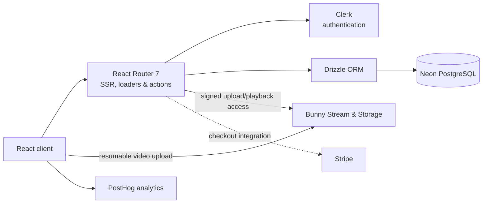

<div align="center">
  <picture>
    <source media="(prefers-color-scheme: dark)" srcset="public/logo-dark.svg">
    <source media="(prefers-color-scheme: light)" srcset="public/logo-light.svg">
    
  </picture>

# HP Learny

**A full-stack learning management system for publishing, selling, and completing video courses.**

[](https://www.typescriptlang.org/)
[](https://react.dev/)
[](https://reactrouter.com/)
[](https://neon.tech/)
[](https://tailwindcss.com/)

</div>

## Overview

HP Learny is a responsive course platform built around two complete user journeys:

- **Students** can browse published courses, enroll, stream protected video lessons, download course resources, and track chapter-by-chapter progress.
- **Teachers** can create a course, build and reorder its curriculum, upload videos and attachments, control free previews, publish content, and review sales analytics.

The project demonstrates a production-oriented React architecture: server-rendered routes, authenticated loaders and actions, relational data modeling, direct-to-video-platform uploads, and third-party service integration.

## Product capabilities

| Experience        | Capabilities                                                                                                                           |
| ----------------- | -------------------------------------------------------------------------------------------------------------------------------------- |
| Course discovery  | Published-course catalog, category-aware data model, course cards, and progress indicators                                             |
| Learning          | Protected and free-preview chapters, signed video playback, downloadable attachments, completion tracking, and next-chapter navigation |
| Course authoring  | Draft/publish workflow, course metadata and pricing, chapter creation, drag-and-drop ordering, and per-chapter access controls         |
| Media management  | Resumable video uploads up to 5 GB, encoding-status polling, tokenized playback URLs, image uploads, and CDN-backed attachments        |
| Access control    | Clerk authentication, configurable teacher roles, optional learner email allowlist, and ownership checks on course mutations           |
| Business insights | Per-course revenue visualization plus total sales and revenue summaries                                                                |
| Operations        | Health-check endpoint, versioned database migrations, environment-based configuration                                                  |

## Engineering highlights

- **Full-stack React Router 7:** loaders and actions keep data fetching and mutations close to their routes while server rendering delivers the initial UI.
- **Type-safe persistence:** Drizzle ORM models eight related PostgreSQL tables with indexed lookups, cascading deletes, unique enrollment/progress constraints, and committed SQL migrations.
- **Scalable media path:** Uppy sends large videos directly to Bunny Stream with the tus resumable-upload protocol; the server issues short-lived upload credentials and signed playback URLs without proxying multi-gigabyte files through the app.
- **Progressive authorization:** authentication, teacher-role checks, optional email access controls, ownership validation, and locked paid chapters protect each layer of the product flow.
- **Deliberate content lifecycle:** courses and chapters remain in draft until their required fields are complete, preventing incomplete content from reaching students.

## Architecture



## Technology stack

| Area                 | Technology                                                          |
| -------------------- | ------------------------------------------------------------------- |
| Application          | TypeScript, React 18, React Router 7, Vite 5, Node.js 20+           |
| UI                   | Tailwind CSS, Radix UI, Lucide icons, Recharts, `@hello-pangea/dnd` |
| Forms and validation | Conform and Zod                                                     |
| Database             | Neon PostgreSQL, Drizzle ORM, Drizzle Kit                           |
| Authentication       | Clerk                                                               |
| Video and files      | Bunny Stream, Bunny Storage, Uppy, tus                              |
| Payments             | Stripe webhook foundation; hosted checkout is in progress           |
| Product analytics    | PostHog                                                             |

## Current status

The core authoring, enrollment, learning, media, progress, and teacher analytics flows are implemented. Enrollment currently creates the purchase record directly, which makes the complete course journey testable during development. Stripe signature verification and webhook handling are present, but creating and redirecting to a hosted Stripe Checkout session is still in progress.

Other planned improvements are an automated test suite and restoring the search/category controls whose server-side filtering support already exists.

## Run locally

### Prerequisites

- Node.js 20 or later and npm
- A Neon PostgreSQL database
- A Clerk application
- Bunny Stream and Storage credentials for media uploads
- Stripe credentials only when working on the payment integration

### 1. Install and configure

```sh
git clone https://github.com/phhien203/hp-learny hp-learny
cd hp-learny
npm ci
cp .env.example .env
```

Replace the placeholders in `.env`. The two database URLs must refer to the **same Neon project, branch, and database**: use the pooled URL (a hostname containing `-pooler`) for `DATABASE_URL` and the direct URL for `DATABASE_URL_UNPOOLED`.

| Variables                                   | Purpose                                                                 |
| ------------------------------------------- | ----------------------------------------------------------------------- |
| `DATABASE_URL`, `DATABASE_URL_UNPOOLED`     | Runtime queries and schema operations                                   |
| `CLERK_PUBLISHABLE_KEY`, `CLERK_SECRET_KEY` | Client and server authentication                                        |
| `TEACHER_USER_IDS`                          | Comma-separated Clerk IDs allowed to author courses                     |
| `ENABLE_WHITELIST`, `USER_EMAIL_WHITELIST`  | Optional learner email allowlist                                        |
| `BUNNY_*`                                   | Video creation, upload, signed playback, file storage, and CDN delivery |
| `STRIPE_API_KEY`, `STRIPE_WEBHOOK_SECRET`   | Checkout development and webhook verification                           |

Keep `.env` local and store production values in the deployment platform's secret manager.

### 2. Prepare the database

For a new database with an empty `public` schema:

```sh
npm run db:bootstrap
npm run db:migrate
```

For an existing HP Learny database, run only `npm run db:migrate`. Optionally add the default course categories with:

```sh
npm run db:seed
```

### 3. Start the app

```sh
npm run dev
```

Open the URL printed in the terminal. Add your Clerk user ID to `TEACHER_USER_IDS` to expose the teacher workspace.

## Useful commands

| Command               | Description                                        |
| --------------------- | -------------------------------------------------- |
| `npm run dev`         | Start the development server with hot reload       |
| `npm run build`       | Create the production client and server bundles    |
| `npm run start`       | Serve the production build                         |
| `npm run lint`        | Run ESLint across the project                      |
| `npm run typecheck`   | Generate route types and run TypeScript checks     |
| `npm run format`      | Format the repository with Prettier                |
| `npm run db:generate` | Generate a Drizzle migration after a schema change |
| `npm run db:migrate`  | Apply committed database migrations                |
| `npm run db:seed`     | Insert the default course categories               |

Before committing, run `npm run lint` and `npm run typecheck`. To verify the production path locally, run `npm run build` followed by `npm run start`.

## Project structure

```text
app/
├── components/              Shared UI primitives and application components
├── lib/                     Database, auth, media, analytics, and domain queries
├── routes/
│   ├── api/                 Resource routes for uploads, publishing, and checkout
│   ├── auth/                Clerk sign-in and sign-up screens
│   ├── courses/             Student course and chapter experience
│   └── dashboard/teacher/   Course authoring and sales analytics
├── root.tsx                 Application shell, middleware, and global providers
└── routes.ts                Explicit route configuration
database/bootstrap.sql       Frozen schema for a brand-new database
drizzle/                     Versioned SQL migrations and snapshots
scripts/                     Bootstrap, migration, seed, and database-check scripts
Dockerfile                   Multi-stage production image
```

Routes are configured explicitly in `app/routes.ts`; filenames do not determine public URLs.

## Database workflow

The source of truth is `app/lib/schema.ts`. To change the schema:

1. Update the Drizzle schema.
2. Run `npm run db:generate`.
3. Review and commit the generated SQL in `drizzle/`.
4. Test `npm run db:migrate` against an isolated Neon branch before production.

Keep `database/bootstrap.sql` fixed as the initial schema. The bootstrap command intentionally refuses to run against a non-empty `public` schema. For an isolated CRUD smoke test, run `npx tsx scripts/check-db.ts`; it removes its temporary records when complete.

## Production deployment

Configure the same environment variables in the deployment platform, apply migrations once per release, and build the included Docker image:

```sh
docker build -t hp-learny .
docker run --env-file .env.prod -p 8080:8080 hp-learny
```

The application exposes `GET /healthcheck` for container and platform health probes.
